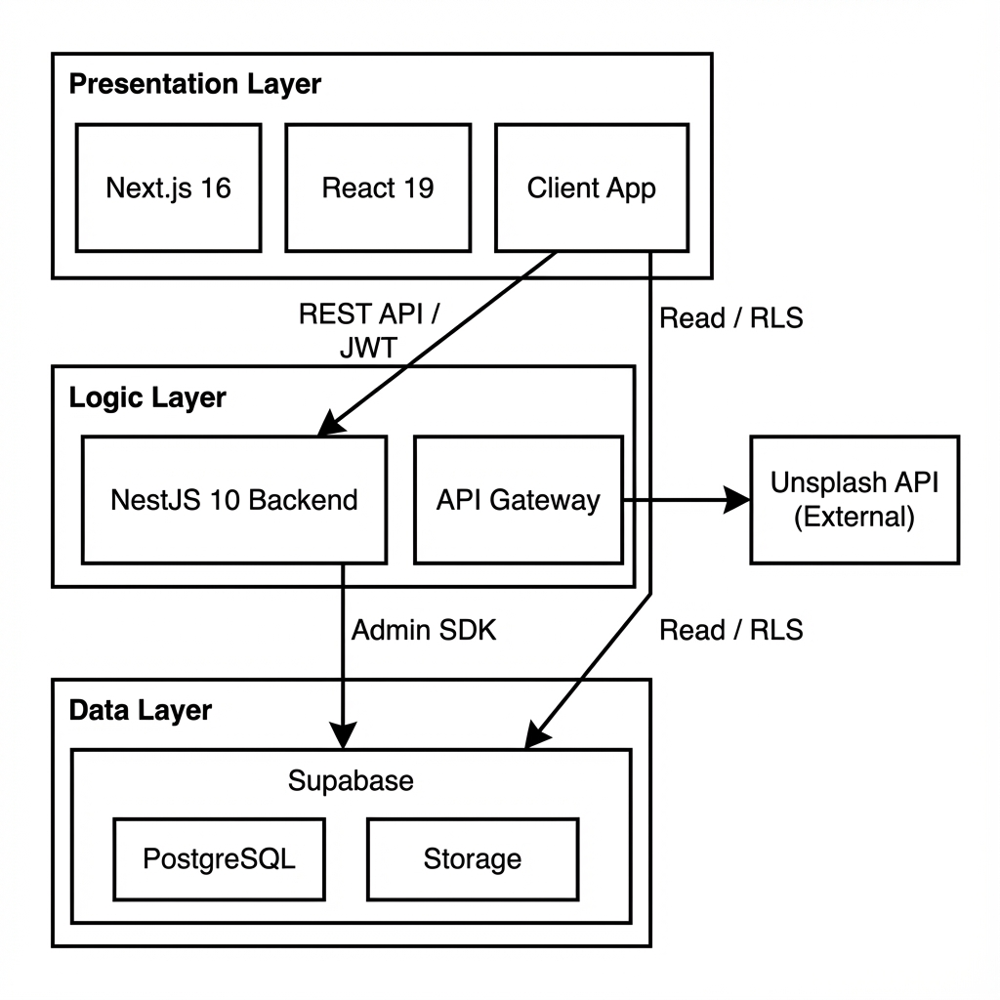

Цел и задачи на дипломния проект

**Основната цел** е разработката на интелигентна платформа за съвместно планиране на пътувания, насочена към потребители на възраст **18–60 години**. Системата функционира като активен асистент, управляван от специализиран **AI оператор със сесийна памет**, който изпълнява конкретни действия чрез хибриден чат интерфейс.

Задачите обхващат създаването на сигурна **автентикация и управление на потребителски профили**, както и пълна функционалност за **управление на пътувания (CRUD)**, достъпни чрез **осемсимволен код за споделяне**. Реализирана е **съвместна работа чрез many-to-many релации**, позволяваща едновременно планиране от множество участници.

Техническото изпълнение включва интеграция на **облачно хранилище за изображения (Supabase Storage)** и **Unsplash API за висококачествени снимки**. Потребителското изживяване е оптимизирано чрез **модерен адаптивен дизайн с тъмна тема и плавни анимации**, подкрепен от **многоезичност (английски и български) с автоматично разпознаване**. Сигурността е гарантирана чрез трислойна архитектура, като сървърният компонент използва **модулен подход с внедряване на зависимости (Dependency Injection)** и **RESTful API backend слой с JWT автентикация**.

## Нефункционални изисквания

Високата **производителност и мащабируемост** на системата са гарантирани чрез оптимизации на **Next.js 16**, осигуряващи време за зареждане под **2 секунди**, и **модулна монорепо архитектура**, позволяваща лесно разширяване на функционалността. Потребителското изживяване (**UX/UI**) е приоритет, реализирано чрез интуитивен интерфейс с **тъмна тема**, плавни анимации и **адаптивен дизайн**, който функционира безпроблемно на мобилни устройства (320px+), таблети и настолни екрани.

**Сигурността** е подсигурена на множество нива, включително **Row-Level Security (RLS)** политики за контрол на достъпа до данни, **JWT автентикация** и защита срещу CORS атаки. В контекста на интегрирания изкуствен интелект, системата спазва принципа за **минимални привилегии** и **обратимост на действията**, като изисква потребителско потвърждение за критични операции. Качеството на програмния код се поддържа чрез **строга типизация (TypeScript strict mode)** и валидация на данните (**Zod**), което улеснява бъдещата поддръжка и развитие на платформата.

# **Проектиране на архитектурата**

Проектираната система е изградена върху стабилна **трислойна архитектура**, която осигурява ясно разграничение на отговорностите. **Презентационният слой** е реализиран чрез **Next.js 16 и React 19**, поемайки изцяло рендирането на потребителския интерфейс. Обработката на бизнес процесите се осъществява в **Логическия слой**, базиран на **NestJS 10**, докато съхранението и управлението на информацията са делегирани на **Слоя за данни** чрез **Supabase** (**PostgreSQL** и **Storage**). Взаимодействието между тези компоненти е визуализирано на _Фигура 1_.



## Компоненти на системата

Архитектурата на системата е съставена от пет ключови компонента, разпределени между клиентската и сървърната част. **Frontend компонентът** е реализиран като Single Page Application (SPA) чрез **Next.js** и **TypeScript**, като следва стриктна организация на файловата структура: страниците са разположени в директория `/app`, потребителският интерфейс в `/src/components`, персонализираната логика в `/src/hooks`, а локализацията в `/src/i18n`.

Сървърната логика е концентрирана в **Backend компонента**, изграден върху **NestJS API**, който комуникира с базата данни чрез **Supabase Admin SDK** и е разделен на модули за автентикация, управление на пътувания, профили и изображения. За осигуряване на консистентност на данните се използва споделен пакет **Shared Package (@gotrippin/core)**, който централизира Zod валидационните схеми, TypeScript типовете и помощните функции, използвани едновременно от двата слоя.

Управлението на данните се осъществява чрез релационна база данни **PostgreSQL** в среда на **Supabase**, включваща таблици за потребители (`auth.users`), профили (`public.profiles`), пътувания (`public.trips`) и членове на пътувания (`public.trip_members`), защитени чрез политики за сигурност на ниво ред (**Row-Level Security - RLS**). За съхранение на файлове е интегриран **Supabase Storage** с отделни контейнери (buckets) за лични аватари (`avatars` - private) и публични изображения от пътувания (`trip-images` - public read).

## Комуникация и информационни потоци

Обменът на данни в системата е реализиран чрез хибриден модел, оптимизиращ сигурността и производителността. Основната комуникация между **Клиента и Backend сървъра** се осъществява посредством **REST API**, защитен с **JWT токени**, предавани в Authorization хедъра на всяка заявка. За операции, изискващи административни права, Backend сървърът използва **Supabase Admin Client SDK** за директна връзка с базата данни, заобикаляйки стандартните ограничения.

Паралелно с това, клиентското приложение комуникира директно с базата данни за операции на четене, спазвайки стриктни **Row-Level Security (RLS)** политики, и взаимодейства със **Supabase Storage API** за качване и изтегляне на файлове. Интеграцията с външни услуги, като **Unsplash**, се реализира чрез сървърен прокси слой с внедрен **in-memory кеш** (с време на живот 1 час) за оптимизация на заявките.

Моделът за **съвместна работа** позволява на множество потребители да редактират едно и също пътуване едновременно. Синхронизацията се постига чрез абониране за промени в реално време (Realtime subscriptions) към таблицата с активности, което гарантира, че всички участници виждат актуализациите мигновено, без необходимост от ръчно презареждане на страницата.

## Ограничения на системата

Функционирането на платформата е обвързано с определени технически и инфраструктурни ограничения. Системата изисква използването на **модерни уеб браузъри** (Chrome 120+, Firefox 121+, Safari 17+, Edge 120+) и наличието на **постоянна активна интернет връзка**, тъй като не поддържа автономен офлайн режим на работа.

По отношение на капацитета, проектът оперира в рамките на **Supabase Free tier**, което налага лимити от 500MB за базата данни, 1GB за облачното съхранение и максимален размер на файл до 50MB. Едновременната работа на потребителите е ограничена от **Connection pool** с капацитет до 1,000 конкурентни връзки. Интеграцията с външни услуги е съобразена с квотите на **Unsplash API**, позволяващи до 5,000 заявки на час за извличане на изображения.

## Приложни модели и архитектурни шаблони

Системата е изградена върху класическия **Client-Server модел**, където комуникацията се осъществява чрез **REST API** интерфейс, използващ стандартни HTTP методи (GET, POST, PUT, DELETE) за управление на ресурсите. Сървърната архитектура следва **слоеви подход (Layered Architecture)**, разделящ логиката на контролери (маршрутизация), услуги (бизнес логика) и модели (валидация чрез Zod схеми), което гарантира модулност и лесна поддръжка.

От гледна точка на потребителския интерфейс, приложението прилага **хибриден модел на рендиране**, комбиниращ предимствата на **Server-Side Rendering (SSR)** за първоначално зареждане и SEO оптимизация, и **Client-Side Rendering (CSR)** за интерактивност, осигурени чрез Next.js App Router.

# **Технологични решения**

## **Frontend**

| Технология                | Аргументация                                                                                                         |
| :------------------------ | :------------------------------------------------------------------------------------------------------------------- |
| **Next.js 16 + React 19** | Водещ React framework, предоставящ хибридно рендиране (App Router), автоматично разделяне на кода и SEO оптимизация. |
| **TypeScript**            | Гарантира типова безопасност, подобрява качеството на кода и улеснява поддръжката чрез статичен анализ.              |
| **Tailwind CSS v4**       | Utility-first CSS рамка за бързо стилизиране с поддръжка на CSS променливи и модерни цветови пространства (OKLCH).   |
| **shadcn/ui + Radix**     | Колекция от достъпни (accessible) и напълно персонализируеми компоненти, базирани на Radix Primitives.               |
| **Framer Motion 12**      | Библиотека за създаване на декларативни, физически базирани анимации за подобрено потребителско изживяване.          |
| **i18next**               | Индустриален стандарт за интернационализация с поддръжка на namespaces и автоматично разпознаване на езика.          |

## **Backend**

| Технология    | Аргументация                                                                                                            |
| :------------ | :---------------------------------------------------------------------------------------------------------------------- |
| **NestJS 10** | Прогресивна Node.js рамка с модулна архитектура и вградено внедряване на зависимости (Dependency Injection).            |
| **Supabase**  | Backend-as-a-Service платформа, обединяваща PostgreSQL, автентикация и облачно съхранение с вграден контрол на достъпа. |
| **Zod**       | TypeScript-first библиотека за дефиниране и валидация на схеми с автоматично извеждане на типовете.                     |

## База данни и информационен модел

Системата използва релационна база данни **PostgreSQL**, хоствана и управлявана чрез платформата **Supabase**. Този избор гарантира **ACID съвместимост** за интегритет на данните и позволява внедряването на комплексни политики за сигурност на ниво ред (**Row-Level Security**), които са критични за многопотребителската среда.

Информационният модел (Entity-Relationship) е изграден около пет основни същности. Централната таблица `public.trips` съхранява метаданните за пътуванията, включително уникалните кодове за споделяне. Потребителските профили се управляват в `public.profiles`, разширяващи базовата автентикация на `auth.users`. Релацията "много-към-много" между потребители и пътувания се реализира чрез свързващата таблица `public.trip_members`, поддържаща каскадно изтриване за поддържане на чистотата на базата.

За нуждите на детайлното планиране са въведени специализирани таблици: `public.trip_locations` дефинира подредения маршрут на пътуването с географски координати и времеви отпечатъци, а `public.activities` описва конкретните дейности, свързани с тези локации, включително времеви интервали, типове и бележки.

```sql
CREATE TABLE public.trips (
  id UUID PRIMARY KEY DEFAULT gen_random_uuid(),
  title TEXT NOT NULL,
  destination TEXT,
  start_date TIMESTAMPTZ,
  end_date TIMESTAMPTZ CHECK (end_date >= start_date),
  share_code VARCHAR(8) UNIQUE NOT NULL,
  created_at TIMESTAMPTZ DEFAULT now()
);

CREATE TABLE public.trip_members (
  trip_id UUID REFERENCES trips(id) ON DELETE CASCADE,
  user_id UUID REFERENCES profiles(id) ON DELETE CASCADE,
  PRIMARY KEY (trip_id, user_id)
);
```

## Внедряване и експлоатация (Deployment)

Процесът на внедряване на системата е оптимизиран чрез използване на **монорепо архитектура**, управлявана от **npm workspaces**, което позволява споделяне на код и типове между клиентския и сървърния компонент. За нуждите на хостинга се използва инфраструктура, осигуряваща **GDPR съвместимост** и защита чрез **SSL сертификати**. Процесите на интеграция и доставка са автоматизирани чрез **GitHub Actions** (CI/CD), които изпълняват проверки за качество на кода (linting), типова безопасност и автоматично изграждане на приложението при всяка промяна.

## Интеграция с външни системи (API)

Системата разчита на няколко ключови външни услуги за обогатяване на функционалността. Основната интеграция е с **Unsplash API**, която предоставя висококачествено визуално съдържание за корици на пътувания. За оптимизация на заявките и спазване на лимитите е реализиран сървърен прокси слой с кеширане.

В процес на активна разработка е модулът за изкуствен интелект, базиран на **OpenAI API**, който ще изпълнява ролята на интелигентен оператор за планиране. Допълнително е предвидена интеграция с **Tomorrow.io API** за предоставяне на прецизни метеорологични прогнози за всяка локация от маршрута, което ще позволи на потребителите да планират своите дейности спрямо климатичните условия.

**Силни страни:**

- Проектът е на професионално ниво \- модерни технологии, ясна логика, добри архитектурни решения.
- Много добре формулирани задачи и нефункционални изисквания.
- ER моделът е напредничав.
- Добра интеграция на Supabase, JWT, RLS, i18n и cloud storage.
- Документацията е технически грамотна.

**Основни пропуски:**

- Добави диаграми , това е най-големият пропуск при теб \- архитектурата и комуникацията са описани, но не визуализирани.
- Части от текста звучат като README, не като дипломен документ.
- Липсва sequence диаграма, която е абсолютно задължителна за съвременен web проект.
- Може да опишеш и error-handling flow (API limits, storage failures, auth expiry).
